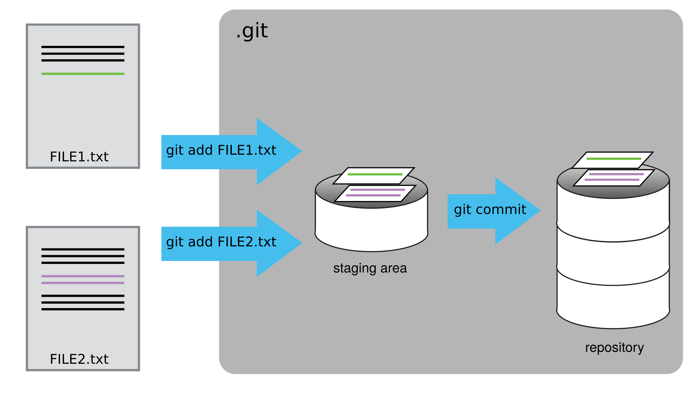
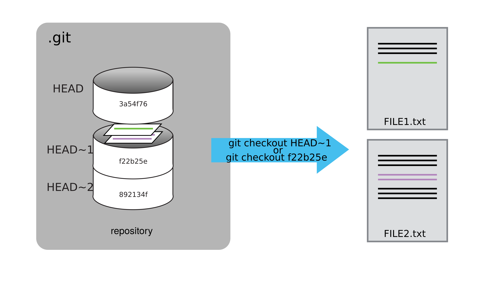
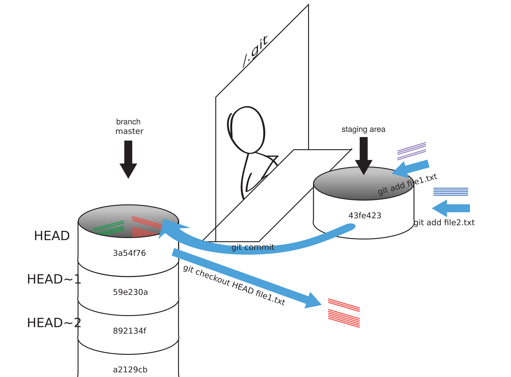
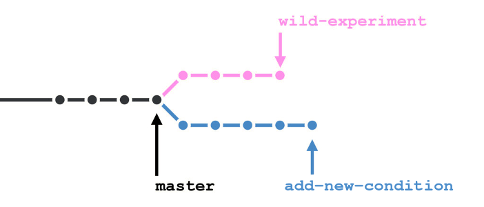
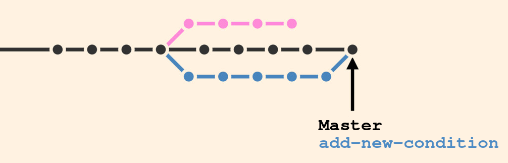

# Git for psychologists

This is a very short introduction to git. Check out these excellent, more elaborate tutorials if you need more:

- [Version Control with Git for scientists](http://swcarpentry.github.io/git-novice/) (source of illustrations below)
- [Essential skills for reproducible research computing](https://barbagroup.github.io/essential_skills_RRC/git/git/)
- [Git for Scientists: A Tutorial](http://nyuccl.org/pages/gittutorial/)

Here are some journal articles on the use of git in science:

- Ram, K. 2013. [Git can facilitate greater reproducibility and increased transparency in science](http://www.scfbm.org/content/8/1/7). Source Code for Biology and Medicine 8:7.
- Mascarelli, A. 2014. [Research tools: Jump off the page](http://www.nature.com/naturejobs/science/articles/10.1038/nj7493-523a). Nature jobs 507: 523-525.

## What's Git?

- Think: revision history/track changes/undo for entire folders
- aka: "version control system"
- Stream of snapshots, can be played back (the story of your project)
- Keeping record of what has changed (when & who)
- Useful for the "lone coder", excellent for collaboration
- Developed for software development: code
- But also works on anything that is **plain text** (.csv,.py,.html,.md,...), e.g. csv-data, analysis/experiment code, reports, manuscripts,...
- Advanced git tools do not work on docx, image, pdf files (you could consider using [pandoc](https://www.pandoc.org))


## Installing Git

- [Download here](https://git-scm.com/downloads) (Mac/Win/Linux)
- Open a command line (Rstudio -> Git -> More -> shell)
- Set up your git email by typing *git config --global user.email YOUR_EMAIL*
- Set up your git name by typing *git config --global user.name YOUR_NAME*
- Create a [Github account](https://github.com/join). Use the same email you used to configure git.


## Git cracking

Several ways to use git: 

- [Command line](https://try.github.io/levels/1/challenges/1)
- GUI (e.g. [gitkraken](https://www.gitkraken.com/), [video tutorial](https://www.youtube.com/watch?v=f0y_xCeM1Rk))
- On [Github](https://www.github.com)
- **inside Rstudio** (Most accessible)


## Initialize your project

- Rstudio $\to$ New project $\to$ from new directory $\to$ tick: "create git repository"

*or* (**Recommended**): 

- Github $\to$ Repositories $\to$ New and follow the instructions to make a new "repository". Take note of the url of your repo. (should be of the form: `https://github.com/*your_username*/*your_repo_name*.git`)
    * then in Rstudio: New project \to from version control $\to$ repository url

*or*: 

- Create a project folder and in project folder, run command: **git init**


## Your new repository ("repo")

Automatically creates:

- *.git*-folder where your version history lives
- *.gitignore*-file lists filetypes that should be ignored. e.g. backup files created by our editor or intermediate files created during data analysis. You could also use this if you do not want to share particular (e.g. data) files of your project (in case your repo is public). 
- Optional: a *README* file (through github)
- Optional: a *LICENSE* file (through github)


## Your git workflow

- First you code, gather data, write, analyze, plot,...
- Then you add files (**"staging"**): *determines what will go into the snapshot.*
    - Rstudio: git tab $\to$ Check boxes
    - *git add myfile.txt*
- Then you commit
    - Rstudio: git tab $\to$ Commit
    - *git commit -m "my commit message"*
    - Be informative in your commit message. Like when commenting your code, [focus on the why](http://chris.beams.io/posts/git-commit/))




## Why two steps? 

Git insists we add files explicitly before committing to allow us to commit our changes in stages and capture changes in logical portions rather than only large batches.

(But you could do: *git commit -a* if you want to commit everything)


## When to commit?

- At least daily (if you have worked on the project)
- But better: more frequently (logical chunks): 
    - I finished building this functionality or fixed this bug,   
    - I added this section/analysis/figure (cf. sensible commit message).
    - I finished testing a (batch of) participant(s). 
    - When going from pilot to actual, etc.

# Understanding diff & status, & log

In Rstudio: 

- go to the git tab $\to$ history
- You'll see the history of all commits, with their message, their author, date and SHA (unique identifier of the snapshot)
- You can browse through all changes (additions in green, deletions in red) for each commit.

Command line:

- *git status* (where are you in your project)
- *git log* (overview of all commits)
- *git diff* (changes made to a repo since the most recent commit)
- *git diff 47f748 09633c myfile.py* (changes between two commits for myfile)


## Restoring files aka time travel!

Sometimes we want to restore a previous version of a file entirely. 

- *git log --oneline*: look up the commit identifier of the commit you want to revert back to
- *git checkout 47f748 myfile.py*: retrieve the previous version of the file 'myfile.py' (use commit identifier of the state before the change we’re trying to undo)
- Commit to finalize the restore: Rather than eliminating the commits that were made, git creates a new commit that changes everything back, i.e. you can change your mind again. (git never forgets/is failsafe)



## Git summary




## Pushing & pulling

- Git has no automatic sync for collaborating (constant syncing in real time would be a disaster for code)
- in Rstudio: from git tab $\to$ push (after commiting locally)
- When collaborating, ie changes have may been pushed by someone else: in Rstudio: git tab $\to$ pull (to update your local repo with the changes made in the cloud/github)

Command line: 

- *git remote add origin https://github.com/try-git/try_git.git*
- *git push origin master*
- *git pull origin master*


## Conflicts & merging

But what happens if we make a commit in both places?

- Try it: change the README on the github repo (*btw: you can edit files directly in Github*). Your push (from Rstudio) will be rejected because there are changes on the github repo that aren't yet present locally. $\to$  do a pull first & git will try to auto-merge the local and github repo. However: If change in same line/file, you will have to manually resolve them and commit. Git will help you by indicating the conflict with "**<<<<<<<**"" in the file, as seen below. [More about how this works](http://swcarpentry.github.io/git-novice/09-conflict/).

```
[...]
From https://github.com/vlad/planets
 branch            master     -> FETCH_HEAD
Auto-merging mars.txt
* CONFLICT (content): Merge conflict in mars.txt
* Automatic merge failed; fix conflicts and then commit the result.
[...]
```
  
--


```
[...] The two moons may be a problem for Wolfman
But the Mummy will appreciate the lack of humidity
* <<<<<<< HEAD
We added a different line in the other copy
* =======
This line added to Wolfman's copy
* >>>>>>> dabb4c8c450e8475aee9b14b4383acc99f42af1d
[...]
```

## Cloning, forking, & branching

- Cloning: download local copy of existing repo (cannot push to origin)
- Forking: copy of existing repo under your account. Keeps the link between projects $\to$ *pull requests* on github
- Branching: a local fork to work on a new feature, a new version, to experiment with variants of your code [more info](https://barbagroup.github.io/essential_skills_RRC/git/branching/).



A new branch can be merged again with the *master* branch (or removed). Branching is only possible with the command line.




## What to use git for?

- All your code:
    - Your experiment code 
    - R or python analysis scripts. Markdown/RMarkdown files and Jupyter notebooks will appear in human-readable, pretty format on github!
- You can use it to backup/share your (behavioral) data and stimuli too. But there are size limits for non-text files (for very large stimuli or data files, use figshare, Zenodo, OSF.io).
- What about manuscripts? Only if you write in markdown or latex (but no good solution yet for citations, track changes). You can check out [Authorea](https://www.authorea.com/) for an alternative git-based writing tool.
- Private github repos means you choose when to make your repo/project public (also the case for osf.io). [Unlimited private repos for academics](https://education.github.com/pack).

## More advantages

- Integrity of each commit is checked (safety against file corruption) with checksums (hash values of content = names in git db)
- Backup on another computer (safer & better ordered than dropbox, cf code conflicts)
- Collaboration (one common repo on github): better conflict management
- Commits helps you tell the story of your project to other people (reproducibility)
- Time-stamped (pre)registration of steps in your project (if you commit, of course)

## Further tools that connect with git(hub)

- Github-[Open Science Framework integration](https://osf.io/) (OSF): 
    - Two-way sync between github & osf.io means you can edit files in OSF, in github, or locally (when pushing to github).
    - Storage **remains** in github 
- Persistent copy needed? [Zenodo](https://guides.github.com/activities/citable-code/) or [figshare](http://ivory.idyll.org/blog/2016-using-zenodo-to-archive-github.html) can archive your github repo (with a citable DOI). 
- Github watching & forking (take existing project/experiment as basis to start yourself; also on OSF)
- Reputation system (for some jobs in the private sector, gtihub account is de facto cv/portfolio)
- [GestaltReVision repos](https://github.com/gestaltrevision)


**Don't panic: Your code is good enough ;-)**

