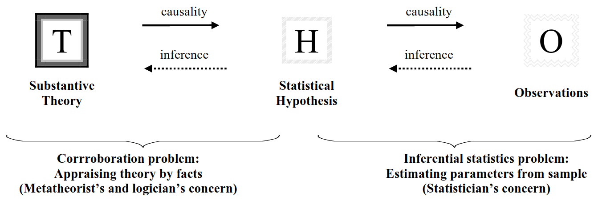

background-image: url('img/researchCycle.jpg')
background-size: 700px

# Reproducibility crisis

---

# Emphasis on better procedures/practices 

Why? 
- Evaluation of quality of procedures & evidence is often easier (than quality of theory)
    - Lack of background in metatheory, "theory appraisal" (philosophy of science)
--
- Often naive ideas about the relation theory-data
    - Either simple falsificationism/naive empiricism, or "all observation is theory-laden"

--

Bad theories (or logic) lead to "tests" that are at best uninformative and at worst deceiving. 

- Failure in (conceptual) replications
- Non-cumulative

---

# Problems with traditional testing logic

- Traditional falsification: 
    - in physics: point prediction, significance is falsification
    - but in psychology, null is rejected, not theory of interest -> corroboration
--

- Indeterminacy problem: infinite amount of theories that can explain these data. So appraising theories, by what principles?

--

.right[Meehl, 1990]
.right[]

???
- So we think we kinda are doing the real science ritual, but actually.
- most reprod crisis recommendations/studies focus on righthand (weird because Meehl already knew you need to cover both sides)
- People often equate substantive theory with statistical hypothesis and to equate the appraisal of substantive theories with something like, or even identical with, the testing of a statistical hypothesis -> abuse of null  hypothesis  refutation  as  a way  of  corroborating  substantive theories (sexy hypothesis testing)

---
class: inverse, center, middle

# Logical structure of what we do (Meehl):

###($T \& A_{t} \& C_{p} \& A_{i} \& C_{n}) → (O_{1} \implies O_{2}$)

If ($O_{1} \& \neg O_{2}$): falsifies complete left hand, not just T (not what we wanted).

???
 T is the theory of interest, 
At the conjunction of auxiliary theories needed to make the derivation to observations go through, 
Cp is a ceteris paribus clause (“all other things being equal”), 
Ai is an auxiliary theory regarding instruments, and 
Cn is a statement about experimentally realized conditions (particulars). 
So when we write our conclusions we need to make all these assumptions plausible.

---
# Auxiliary theory in more complex in psy

- The task theory (e.g. different strategies for doing task, often implicit)

--

- T & aux. not easily disentangled

--

- Levels, aux. from different disciplines

--

- Observation/measurement theory 
    - cf. risk in method instead of in theory test. Waw, did they get this to work, instead of: great corroboration of this clever theory.
---

# Strength of corroboration

- ~Risky test: on some basis (prior experience, other theory, or common knowledge and intuition), absent the theory T, we see no reason for thinking that $O_{2}$ has a high probability conditional upon $O_{1}$. 
- $O_{2}$ refers to a point value, or narrow numerical interval, selected from a wide range of otherwise conceivable values. Being specific or precise (restrictive as to what variability can’t be perceived).
- Since all our theories are incomplete and literally false (even if T may not be literally false): focus on verisimilitude (instead of falsification):  approaching truth better, better than alternatives (degree). Theory builds up credit through predicting **"damn strange coincidences"** (cf. "accidentalness")

???
- HIPPEA: finding a deficit in a task that is also more difficult?
-  HIPPEA (explanation of directed difference in some task) vs classical (description of directed difference direction, across all tasks). Specificity/precision, but still weak: no point value, no curve (though there are predictions of dynamics you could make)

---

# Theoretical defense against falsification

An apparent  falsifier  fended off by **"adhockery"**: 
- by challenging  the  other assumptions,  
- by  adding  an  additional  entity  or  theory ("patch"),  
- by challenging the ceteris  paribus clause.

## When legitimate, how, & for how long?

*Adhockery, like procedural fiddling, is not bad in itself. Indeed it is what science is.*

(HARKING, like p-hacking, is only a problem in conventional null-hypothesis testing environment.) 

---

# Progressive vs degenerative research programme (Lakatos)

 
- Does it have unity within the coherent framework or research tradition?  (inspired by important theoretical principles vs alien element pasted on)
- Does it predict or forbid sth new? (greater explanatory/predictive power? vs just-so)

cf. Moderator issue in failures to replicate: More serious task.

???
- HIPPEA uncertainties? + hyperreactivity vs hyporeactivity
- The difference between a progressive and a degenerative research programme.

---
# Theoretical ideas are really frail (but dichotomies last forever)

- The extend we should defend by (the good kind of) ad hoc adjustments depends on the credit accumulated
- But sometimes: pays to continue anyway (always with explicit acknowledgement that there isn’t much credit 
- Scientist’s "intuition" (irrational but important): 
    - best case: it will be articulated eventually. 
    - Worst case: sticking with pet theory till death. But this guy will become very proficient in undermining competitive accounts (adversarial research!)

- Prefer  theories that  imply  qualitatively  diverse  facts.
- Simplicity/parsimony (but why?)
- **Convergence**

Goes against current research climate
  - Easier to churn out a steady stream of publications based on variants of the same task, and a thin task (paradigm-dependent) theory.
  - Paradigm becomes target instead of tool, replaces original hypotheses and shapes new task-specific hyptheses
  - (field-specific) dichotomies allow infinite back and forth

Traditions become isolated & not cumulative, theories tailored to paradigm, confusing empirical effects with theory-driven research questions and overlooking similar findings from other paradigms and more integrative theoretical frameworks with a broader range of applicability and testability.

???
Ultimately: we don’t know what leads to best progress in psy (probably combi, interaction). But we need to take heed that there are not evenly compatible with the current scientific climate.
Metatheory  should  be conducted  by  random  sampling  of  episodes  in  the  history  of  science, applying  formal  statistical  and  psychometric  methods  to  analyze  the results.

---

# (Mechanistic) explanation

> *A mechanism is a structure performing a function in virtue of its component parts, component operations, and their organization. The orchestrated functioning of the mechanism, manifested in patterns of change over time in properties of its parts and operations, is responsible for one or more phenomena of interest.* (Bechtel)

--

#### It should render the phenomonon intelligible in terms of processes that we (can hope to) understand better than the phenomena we are seeking to explain.

???
High bar which a lot of theories referring to attention, global-local/TOM in ASD (decriptive), dichotomies will not reach. Even reward.

---
background-image: url('img/Gadfly1.png')
background-size: 500px

# So what is a psychologist to do? 

*Most psychologists like people, in theory.*

We need more:
- Rich/”thick” description as an ethnographer (but augmented by sensors and tasks) (*big data*)

--

- Creation & application of big theory (*big ideas*)
  
  Hypothesis testing if:
    - it is based on sound, tight derivation chains, 
    - it concerns damn strange coincidences (risky predictions)

--

- Experiments for theory creation instead of theory selection

--

 $\implies$ To be most forceful in a role as **gadfly** (this doesn’t fit, this is an interesting pattern, that’s not sufficiently explained,...).
 
---
background-image: url('img/disciplines.png')
class: bottom, left

# The diplomatic picture

---
background-image: url('img/horse.jpg')
class: bottom, left

# No horsing around

---
background-image: url('img/doomed.jpg')
class:right

# Thanks!

